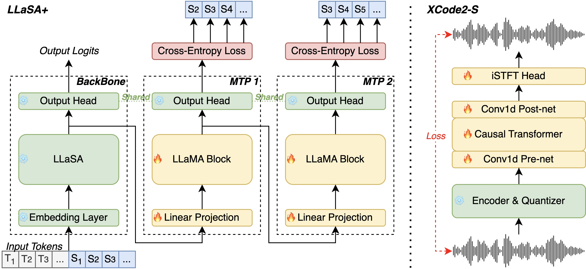

<!-- # LLaSA_Plus
# <a href="examples/README.md">here</a>
[](https://arxiv.org/abs/2502.04128) -->

<p align="center">
   <h1>LLaSA+: Free Lunch for Accelerated and Streaming Llama-Based Speech Synthesis</h1>
</p>

With an additional 10% parameters, LLaSA+ achieves 1.5X faster without performance degradation compared to LLaSA

<p align="center">
    
<p>

## TODOs
- [x] Release Inference code.
- [x] Release Training code.
- [ ] Release paper to Arxiv.
- [ ] Support local deployment.
- [ ] Support Streaming Inference.
- [ ] Online serving on Hugging Face Space.

## Inference

Following the steps below to clone the repository and install the environment.

```bash 
# clone and enter the repositry
git clone https://github.com/ASLP-lab/LLaSA_Plus.git
cd LLaSA_Plus

## create python environment
conda create -n llasa+ python=3.10
conda activate llasa+

## OR you can use classic Python virtual enviroment instead of conda
python -m venv venv
# activate venv on Linux
source venv/bin/activate
# activate venv on Windows
venv\Scripts\activate

## install requirements
pip install -r requirements.txt
```

On Linux you can now infer by:
```bash
# Inference for text2speech
python3 inference_llasa_open.py
```

## Training
Quick start or to view detailed fine-tuning instructions

```bash
cd training/finetune/offline_finetune
conda activate llasa+
# start fine_tuning
bash train_rms_mtp2_notcat.sh

For more information on fine-tuning, see:
[Fine-tuning Instructions](./training/finetune/offline_finetune/README.md)

```

## Data

Our models are fine_tuning on LibriTTS.

You can download original open-source speech data [here](https://www.openslr.org/60/). This includes LibriTTS approximately 585 hours of open-source data.


